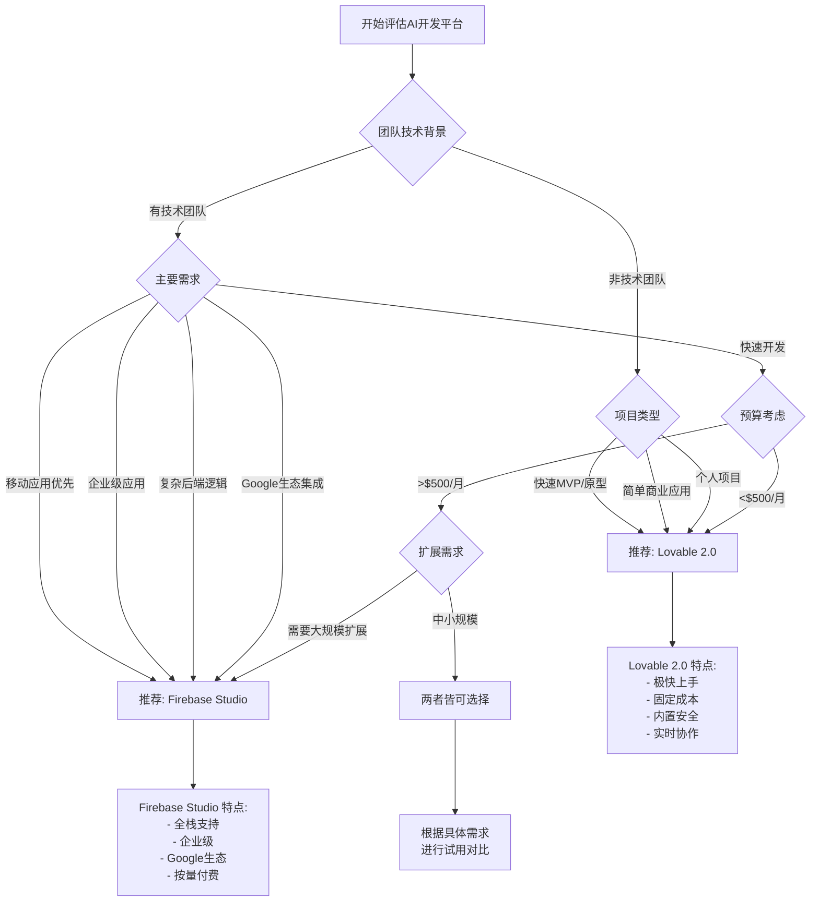

# 决策流程图和快速参考

## 🚀 快速决策流程图



## 📊 功能对比矩阵

| 功能维度 | Lovable 2.0 | Firebase Studio | 获胜者 |
|---------|-------------|-----------------|---------|
| **学习曲线** | 🟢 极简 (2小时) | 🟡 中等 (1-2周) | Lovable |
| **开发速度** | 🟢 极快 (分钟级) | 🟡 较快 (小时级) | Lovable |
| **AI智能程度** | 🟢 Chat Mode Agent | 🟡 Gemini辅助 | Lovable |
| **代码质量** | 🟡 生成质量高 | 🟢 专业可控 | Firebase |
| **移动支持** | 🔴 有限 | 🟢 原生支持 | Firebase |
| **扩展性** | 🟡 中等 | 🟢 优秀 | Firebase |
| **安全性** | 🟢 内置扫描 | 🟡 需配置 | Lovable |
| **成本可控** | 🟢 固定价格 | 🟡 按量计费 | Lovable |
| **企业功能** | 🟡 基础 | 🟢 完整 | Firebase |
| **生态集成** | 🟡 有限 | 🟢 丰富 | Firebase |

**图例**: 🟢 优秀 | 🟡 良好 | 🔴 一般

## ⚡ 快速选择指南

### 选择 Lovable 2.0 如果你...

✅ **立即行动场景**
- 需要在一周内验证商业想法
- 团队中没有开发人员
- 预算有限但需要专业外观的应用
- 重视安全但不想自己配置

✅ **适合的项目类型**
- SaaS工具和仪表板
- 电商网站和展示页面
- 内容管理系统
- 简单的社交平台
- 预约和订单系统

### 选择 Firebase Studio 如果你...

✅ **技术导向场景**
- 团队有专业开发人员
- 计划构建复杂的移动应用
- 需要与Google服务深度集成
- 预期用户量会大幅增长

✅ **适合的项目类型**
- iOS/Android原生应用
- 实时聊天和协作工具
- 数据密集型应用
- 企业级业务系统
- AI/ML驱动的应用

## 🎯 按行业推荐

| 行业 | 首选平台 | 原因 | 注意事项 |
|------|---------|------|----------|
| **电商零售** | Lovable 2.0 | 快速上线，内置支付 | 大规模时考虑迁移 |
| **金融科技** | Firebase Studio | 合规和安全要求 | 需要专业开发团队 |
| **教育培训** | Lovable 2.0 | 快速内容发布 | 复杂交互选Firebase |
| **医疗健康** | Firebase Studio | HIPAA合规 | 确保数据合规 |
| **媒体内容** | Lovable 2.0 | 快速原型和测试 | 高并发选Firebase |
| **企业服务** | Firebase Studio | 集成需求复杂 | 小工具可选Lovable |
| **游戏娱乐** | Firebase Studio | 实时功能需求 | 简单游戏可选Lovable |

## 💰 预算规划指南

### 启动阶段 (0-6个月)
```
Lovable 2.0:
- 免费试用: $0 (有限功能)
- 基础开发: $25-30/月
- 总投入: $150-180

Firebase Studio:
- 免费预览: $0 (当前)
- 预期成本: $0-50/月
- 开发时间成本: $500-2000
- 总投入: $500-2050

推荐: Lovable 2.0 (成本优势明显)
```

### 成长阶段 (6-18个月)
```
Lovable 2.0:
- 月度费用: $30-100
- 年度总成本: $360-1200
- 额外开发: $0-500

Firebase Studio:
- 月度费用: $50-300
- 年度总成本: $600-3600
- 维护成本: $1000-3000

推荐: 根据技术需求选择
```

### 扩展阶段 (18个月+)
```
Lovable 2.0:
- 企业版: $1000-3000/月
- 定制开发: $5000-20000
- 年度总成本: $17000-56000

Firebase Studio:
- 按量付费: $200-2000/月
- 持续优化: $2000-8000/年
- 年度总成本: $4400-32000

推荐: Firebase Studio (长期成本效益)
```

## 🔄 迁移策略

### 从 Lovable 到 Firebase Studio
```
适用场景:
- 用户量快速增长
- 需要移动应用
- 需要复杂功能
- 技术团队成熟

迁移步骤:
1. 导出Lovable代码
2. 分析现有架构
3. 设计Firebase架构
4. 数据迁移规划
5. 逐步迁移功能
6. 用户迁移

预期时间: 2-6个月
预期成本: $5000-20000
```

### 从 Firebase Studio 到 Lovable
```
适用场景:
- 简化产品需求
- 减少技术复杂度
- 降低运营成本
- 团队技术能力不足

迁移挑战:
- 功能可能需要简化
- 移动应用需要重新考虑
- 数据结构可能需要调整

一般不推荐此方向迁移
```

## 📈 成功案例参考

### Lovable 2.0 成功场景
```
案例1: 创业公司MVP
- 行业: SaaS工具
- 时间: 2周从想法到上线
- 团队: 2人非技术团队
- 成本: $30/月
- 结果: 获得首批付费用户

案例2: 电商原型
- 行业: 手工艺品销售
- 时间: 1周构建原型
- 团队: 1人设计师
- 成本: $25/月
- 结果: 成功验证市场需求
```

### Firebase Studio 成功场景
```
案例1: 企业移动应用
- 行业: 物流管理
- 时间: 3个月开发完成
- 团队: 5人技术团队
- 成本: $500/月
- 结果: 支持1000+并发用户

案例2: 实时协作平台
- 行业: 在线教育
- 时间: 6个月完整开发
- 团队: 8人全栈团队
- 成本: $800/月
- 结果: 日活跃用户5000+
```

## 🚨 风险评估

### Lovable 2.0 风险
| 风险类型 | 风险级别 | 缓解策略 |
|---------|---------|----------|
| **平台依赖** | 🟡 中等 | 定期代码导出，学习迁移 |
| **功能限制** | 🟡 中等 | 早期评估功能需求 |
| **扩展瓶颈** | 🟠 较高 | 制定扩展计划 |
| **成本增长** | 🟢 较低 | 固定价格模式 |

### Firebase Studio 风险
| 风险类型 | 风险级别 | 缓解策略 |
|---------|---------|----------|
| **技术复杂度** | 🟠 较高 | 团队技能培训 |
| **成本控制** | 🟡 中等 | 监控和预算管理 |
| **Google依赖** | 🟡 中等 | 多云策略考虑 |
| **学习曲线** | 🟠 较高 | 渐进式学习计划 |

## 📚 推荐学习路径

### Lovable 2.0 学习路径
```
第1天: 基础概念和注册试用
第2-3天: 完成第一个简单应用
第4-7天: 探索高级功能
第2周: 团队协作和部署
第3-4周: 安全设置和优化

学习资源:
- 官方文档和教程
- YouTube视频教程
- 社区论坛和Discord
- 官方博客案例分析
```

### Firebase Studio 学习路径
```
第1周: Firebase基础概念
第2-3周: 开发环境搭建和基础项目
第4-6周: 深入学习核心功能
第7-8周: 高级功能和最佳实践
第9-12周: 企业级功能和部署

学习资源:
- Google官方文档
- Firebase University课程
- YouTube Firebase频道
- GitHub示例项目
- 技术博客和教程
```

---

*该决策指南定期更新，建议收藏并关注最新版本。*
