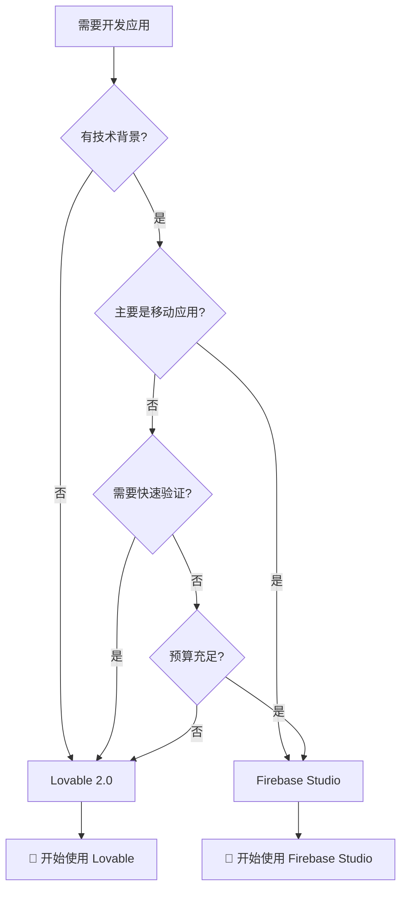

# 快速开始指南

## 选择决策流程图



## Lovable 2.0 快速开始

### 第一步：注册和设置

1. **访问官网**
   ```
   网址: https://lovable.dev
   注册: 使用Google账号或邮箱注册
   验证: 邮箱验证后即可使用
   ```

2. **选择计划**
   ```
   建议: 先使用免费版熟悉平台
   升级时机: 当每日5条消息不够用时
   ```

### 第二步：创建第一个项目

1. **项目初始化**
   ```
   1. 点击"New Project"
   2. 选择模板（推荐：Web App）
   3. 输入项目名称
   4. 点击"Create"
   ```

2. **使用Chat Mode Agent**
   ```
   示例提示:
   "创建一个简单的待办事项应用，用户可以添加、删除和标记完成任务。
   界面要简洁现代，使用蓝色主题。"
   
   等待AI分析和规划（通常1-2分钟）
   确认计划后点击"Implement"
   ```

### 第三步：定制和优化

1. **可视化编辑**
   ```
   - 点击任何UI元素直接编辑
   - 修改颜色、字体、间距
   - 添加或删除组件
   - 实时预览更改
   ```

2. **功能迭代**
   ```
   继续使用Chat Mode添加功能:
   "添加任务分类功能"
   "增加任务优先级设置"
   "添加搜索功能"
   ```

### 第四步：部署发布

1. **安全检查**
   ```
   点击"Security Scan"
   等待扫描完成
   修复发现的问题（如有）
   ```

2. **部署应用**
   ```
   1. 点击"Deploy"
   2. 选择域名（可使用免费子域名）
   3. 确认部署设置
   4. 等待部署完成（通常1-2分钟）
   ```

### 常见问题和解决方案

**Q: AI不理解我的需求怎么办？**
```
A: 尝试更详细的描述：
   ❌ "做个网站"
   ✅ "创建一个餐厅官网，包含菜单展示、在线预订和联系信息"
```

**Q: 如何添加自定义域名？**
```
A: 升级到Pro版本后：
   1. 在项目设置中点击"Custom Domain"
   2. 输入域名（如 myapp.com）
   3. 按提示配置DNS记录
   4. 等待验证完成
```

**Q: 可以导出代码吗？**
```
A: 是的，Pro版本支持：
   1. 点击项目设置
   2. 选择"Export Code"
   3. 下载完整的React项目
   4. 可以在本地继续开发
```

## Firebase Studio 快速开始

### 第一步：前期准备

1. **账号准备**
   ```
   需要: Google账号
   访问: https://firebase.studio
   注意: 当前为预览版，功能可能变化
   ```

2. **了解基础概念**
   ```
   必须了解:
   - React/Next.js基础
   - 组件化开发概念
   - 基本的JavaScript/TypeScript
   
   可选了解:
   - Firebase服务（Auth、Firestore等）
   - Cloud Functions
   - React Native（如需移动开发）
   ```

### 第二步：创建项目

1. **选择模板**
   ```
   Web应用: Next.js + Firebase
   移动应用: React Native + Expo
   全栈应用: Next.js + Cloud Functions
   ```

2. **配置Firebase服务**
   ```
   1. 系统会自动创建Firebase项目
   2. 配置所需服务（Auth、Firestore等）
   3. 设置安全规则（可使用默认）
   4. 获取配置密钥（自动完成）
   ```

### 第三步：开发应用

1. **使用AI辅助开发**
   ```
   在代码编辑器中:
   - 输入注释描述需要的功能
   - 使用Ctrl+Space触发AI建议
   - 选择合适的代码片段
   - 使用AI调试错误
   ```

2. **实时预览**
   ```
   Web预览:
   - 点击"Preview"按钮
   - 在新标签页查看效果
   - 代码更改自动刷新
   
   移动预览:
   - 扫描二维码
   - 在Expo Go中查看
   - 支持热重载
   ```

### 第四步：部署发布

1. **Web应用部署**
   ```
   1. 点击"Deploy to Firebase Hosting"
   2. 选择部署配置
   3. 等待构建完成
   4. 获取应用URL
   ```

2. **移动应用分发**
   ```
   1. 使用"App Distribution"
   2. 邀请测试用户
   3. 生成安装链接
   4. 发布到应用商店（需额外配置）
   ```

### 进阶技巧

**性能优化**
```
使用内置工具:
- Performance Monitoring
- 代码分割分析
- 图片优化建议
- 缓存策略配置
```

**安全配置**
```
1. 配置Firestore安全规则
2. 设置Auth提供商
3. 启用API密钥限制
4. 配置CORS设置
```

**成本控制**
```
1. 设置预算警报
2. 监控使用量仪表板
3. 优化查询效率
4. 使用缓存减少请求
```

## 学习资源推荐

### Lovable 2.0 学习资源

**官方资源**
- [官方文档](https://docs.lovable.dev)
- [视频教程](https://youtube.com/lovabledev)
- [社区论坛](https://community.lovable.dev)

**第三方教程**
```
YouTube搜索: "Lovable 2.0 tutorial"
GitHub: lovable-examples
博客文章: "Lovable vs traditional coding"
```

**实践项目推荐**
1. 个人博客网站
2. 产品展示页面
3. 简单的SaaS工具
4. 事件管理系统

### Firebase Studio 学习资源

**必学基础**
- [React官方教程](https://react.dev/learn)
- [Next.js文档](https://nextjs.org/docs)
- [Firebase文档](https://firebase.google.com/docs)

**Firebase Studio专用**
- [Firebase Studio官方指南](https://firebase.google.com/docs/studio)
- [Gemini AI集成教程](https://ai.google.dev/docs)
- [Project IDX文档](https://idx.google.com/docs)

**进阶学习**
```
课程推荐:
- Firebase全栈开发
- React Native移动开发
- Google Cloud服务使用
- AI辅助编程技巧
```

## 迁移和切换指南

### 从传统开发迁移到Lovable

**适合迁移的项目**
- 简单的展示网站
- 内部管理工具
- MVP验证项目
- 个人/小型商业网站

**迁移步骤**
1. 分析现有功能需求
2. 在Lovable中重新描述需求
3. 使用AI生成新版本
4. 迁移数据（如需要）
5. 更新DNS配置

### 从Lovable迁移到Firebase Studio

**迁移时机**
- 需要复杂自定义功能
- 要开发移动应用
- 团队有技术能力
- 需要更大扩展性

**迁移步骤**
1. 导出Lovable代码
2. 在Firebase Studio创建新项目
3. 迁移组件和逻辑
4. 重新配置数据库和认证
5. 测试和优化

### 两平台并行使用

**策略建议**
- Lovable用于快速原型
- Firebase Studio用于正式开发
- 根据项目阶段灵活切换
- 团队技能分工合作

## 成功案例学习

### Lovable成功案例

**案例1: 创业公司MVP**
```
项目: 在线课程平台
团队: 2人非技术创始人
时间: 2周从想法到上线
结果: 成功获得天使投资
关键: 快速验证市场需求
```

**案例2: 企业内部工具**
```
项目: 员工休假管理系统
团队: HR部门自主开发
时间: 3天完成
结果: 提高HR工作效率50%
关键: 无需IT部门参与
```

### Firebase Studio成功案例

**案例1: 移动电商应用**
```
项目: 本地生鲜配送应用
团队: 3人全栈开发团队
时间: 6周完整应用
结果: 日活用户5000+
关键: 原生移动体验
```

**案例2: 企业数据平台**
```
项目: 销售数据分析仪表板
团队: 5人技术团队
时间: 3个月
结果: 管理层决策效率提升
关键: 企业级可扩展性
```

---

## 行动建议

### 立即开始行动

1. **确定你的需求**：使用决策流程图
2. **选择平台**：基于团队技能和项目需求
3. **注册试用**：两个平台都可以免费试用
4. **构建第一个项目**：从简单项目开始
5. **逐步学习**：根据需要深入学习

### 保持更新

- 关注两个平台的更新动态
- 参与社区讨论
- 分享使用经验
- 考虑参加相关培训

**记住：最好的工具是你实际会使用的工具。开始行动比完美规划更重要！**
